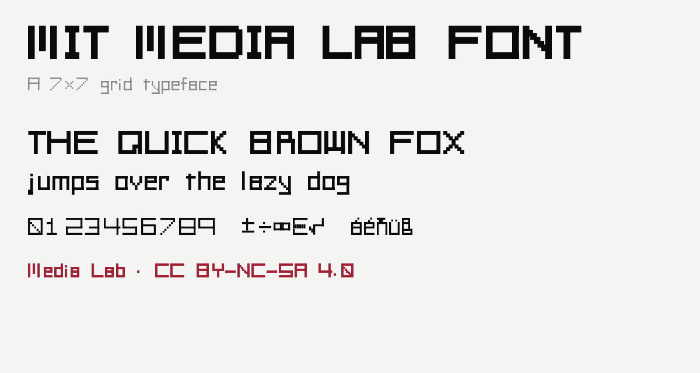
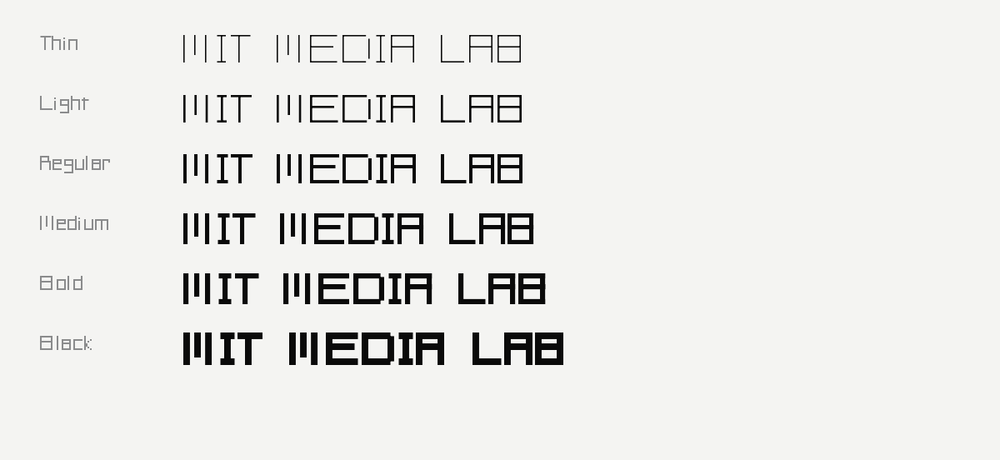
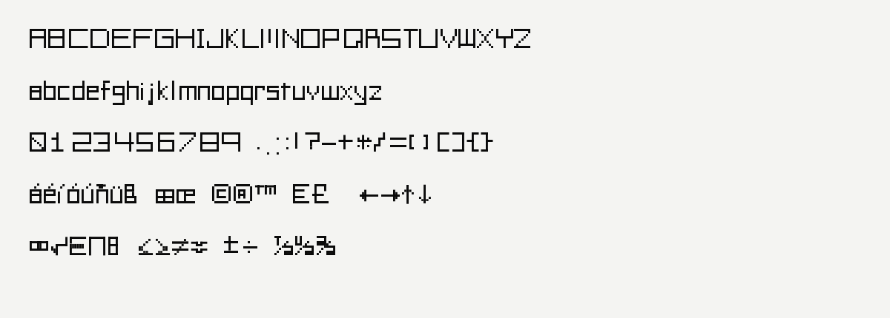
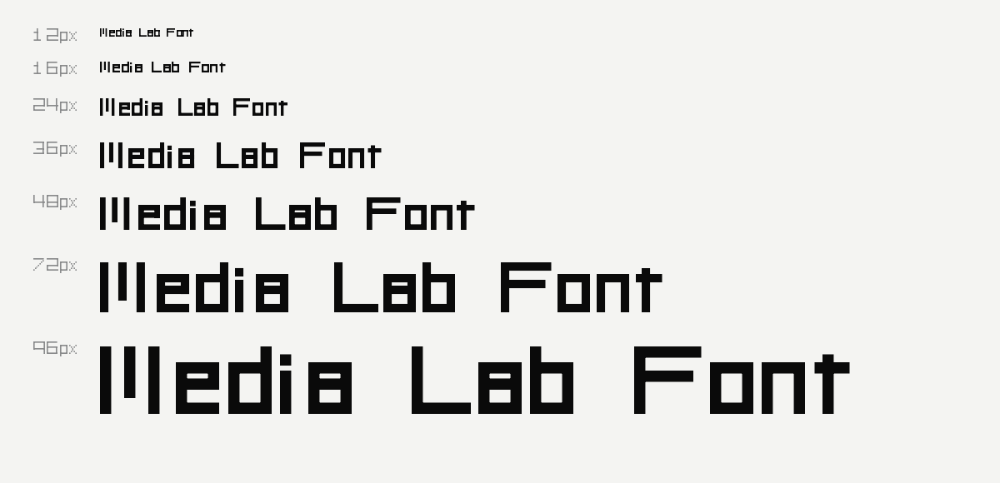
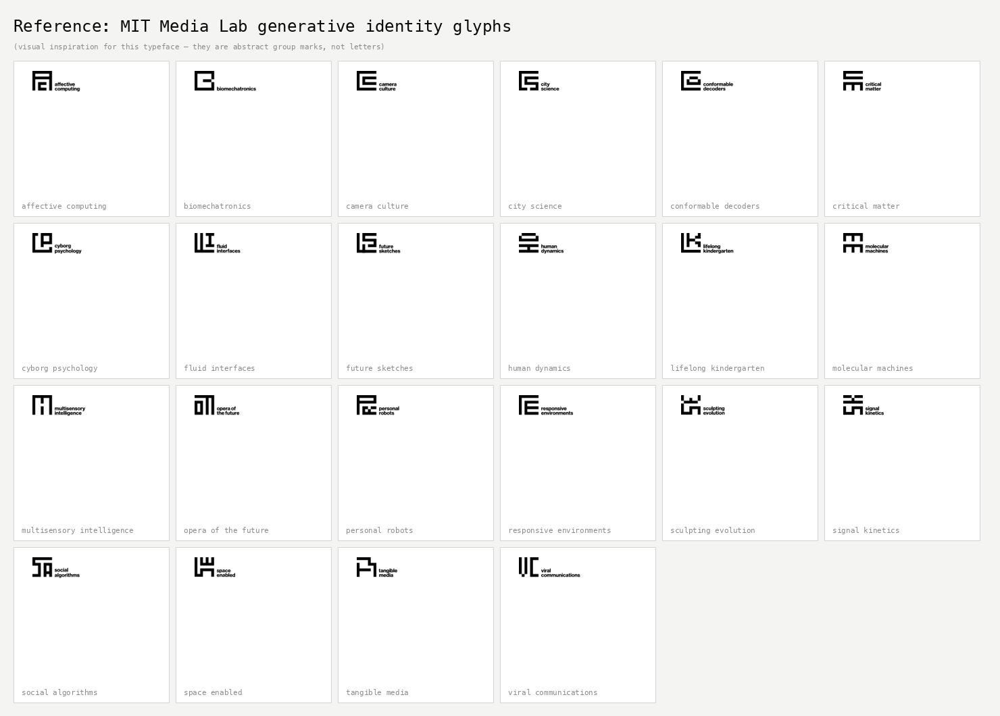

# MIT Media Lab Font

A 7×7 grid typeface in the spirit of the MIT Media Lab's generative identity.
Generated programmatically from a single centerline-stroke source, with six
weights and a built-in demo site.



## Features

- **6 weights**: Thin · Light · Regular · Medium · Bold · Black
- **Both formats**: TTF and OTF for every weight
- **Uppercase, lowercase, numerals, punctuation, accents, math** — 160+ glyphs
- **Brand marks** — MIT wordmark U+E030, Media Lab U+E031
- **24 research group icons** — U+E000–U+E017
- **Pure H/V grid** — every stroke aligns to integer cell positions on a
  7×7 (cap-height) / 5-cell-tall (x-height) body
- **Built from code** — change one number in `src/glyphs.py` and the whole
  family rebuilds
- **CC BY-NC-SA 4.0** (non-commercial)

## Weights



## Character set



## Sizes



## Download

Grab the latest from `dist/` after building, or use the demo site's
**Download font** button which serves the same files (plus a single
`MITMediaLabFont.zip` bundle that includes the license).

Per weight:
- `dist/MITMediaLabFont-{Thin,Light,Regular,Medium,Bold,Black}.ttf`
- `dist/MITMediaLabFont-{Thin,Light,Regular,Medium,Bold,Black}.otf`

## Repo layout

```
mlfont/
├── src/                       ← all Python lives here
│   ├── fetch_group_overviews.py  ← scrape lockup SVGs from overview pages
│   ├── group_glyphs.py           ← icon-only group symbols (U+E000–U+E017)
│   ├── build_font.py          ← glyphs.py → TTF + OTF for all 6 weights
│   ├── build_release.py       ← one-shot: fonts → web → zip → OG → tests
│   ├── make_preview.py        ← glyph-grid PNG for visual QA
│   ├── make_screenshots.py    ← README docs/screenshots/*
│   └── render_glyph_svg.py    ← glyphs.py → standalone glyph SVGs
├── tests/test_font.py         ← cmap / empty / tabular / square checks
├── Makefile                   ← `make release`
├── dist/                      ← built outputs (gitignored if you wish)
│   ├── MITMediaLabFont-*.ttf  ← 6 TrueType files
│   ├── MITMediaLabFont-*.otf  ← 6 OpenType (CFF) files
│   └── svg/                   ← per-glyph SVGs (when render_glyph_svg is run)
├── web/                       ← SvelteKit demo site
├── reference_glyphs/          ← MIT Media Lab group glyphs (visual reference)
├── docs/screenshots/          ← README assets
├── LICENSE                    ← CC BY-NC-SA 4.0
└── README.md
```

## Building from source

Requires Python 3.10+, `fontTools` (≥4.x), and `Pillow` (for OG/previews).

```bash
pip install fonttools pillow
```

One-shot release (fonts → web → zip → OG → screenshots → tests):

```bash
make release
# or: python3 src/build_release.py
```

Build fonts only:

```bash
python3 src/build_font.py
```

The script can be invoked from anywhere in the repo. Outputs always land
in `<repo_root>/dist/`. Build one weight only:

```bash
python3 src/build_font.py strict bold      # just Bold (TTF + OTF)
```

Export individual glyphs as standalone SVGs:

```bash
python3 src/render_glyph_svg.py A                  # one glyph, Regular weight
python3 src/render_glyph_svg.py A B M K --weight bold
python3 src/render_glyph_svg.py --all              # every glyph
python3 src/render_glyph_svg.py --weights all      # one subfolder per weight
python3 src/render_glyph_svg.py A --grid           # with 7×7 grid overlay
```

Outputs land in `dist/svg/`.

## How it works

The whole font is derived from one table of glyph definitions.

1. **`src/glyphs.py`** holds `GLYPHS`, a dict of `char → {'w': body_width, 's': [stroke, ...]}`.
   Each stroke is one of:
   - `('h', y, x1, x2)` — horizontal centerline at `y` from `x1` to `x2`
   - `('v', x, y1, y2)` — vertical   centerline at `x` from `y1` to `y2`
   - A zero-length stroke (`y1 == y2` or `x1 == x2`) renders as a single
     `w × w` square — that's how dots and pixel-grid staircase cells are defined.
2. **`src/build_font.py`** reads `GLYPHS` six times (one per weight). For each glyph
   it expands every centerline into a filled rectangle of thickness `w`, extending
   the endpoints by `w/2` so perpendicular strokes meet flush at corners. Then it
   draws those rectangles into a TrueType pen (for `.ttf`) and a T2 CharString pen
   (for `.otf`), assembles the OpenType tables via `FontBuilder`, and writes both
   files for every weight.
3. **`src/render_glyph_svg.py`** uses the same source to emit standalone SVGs that
   match the font exactly.

### Coordinate system

- 1 cell = 100 font units · UPM = 1000
- Origin `(0, 0)` is the baseline at the glyph's left edge
- `y` grows upward (typographic convention)
- **Cap-height**: 7 cells (`y = 7`)
- **x-height**: 5 cells (`y = 5`) — lowercase tops sit here
- **Ascenders** (b, d, f, h, k, l, t and uppercase): rise to `y = 7`
- **Descenders** (g, j, p, q, y): drop to `y = -2`

### Adding or changing a glyph

Edit the entry in `src/glyphs.py`, then rerun `python3 src/build_font.py`. That's it.
Example — a hypothetical `Ø`:

```python
'Ø': {'w': 7, 's': [
    ('v', 0, 0, 7),                      # left  wall
    ('v', 7, 0, 7),                      # right wall
    ('h', 7, 0, 7),                      # top
    ('h', 0, 0, 7),                      # bottom
    ('v', 1, 1, 1), ('v', 2, 2, 2),      # diagonal slash, as 7 single-cell
    ('v', 3, 3, 3), ('v', 4, 4, 4),      # staircase steps
    ('v', 5, 5, 5), ('v', 6, 6, 6),
]},
```

### Design rules (worth knowing before editing)

- **Only horizontal and vertical strokes.** "Diagonal" letters (A, K, M, N, V, W, X, Y, Z and lowercase + 7) are approximated by single-cell staircase strokes.
- **Centerlines on integer cell positions.** Half-cell positions (e.g. `y = 3.5`) make strokes look 1 pixel offset compared to neighboring letters with integer-aligned strokes. The current font uses integer centerlines throughout. The build script applies a weight-aware sidebearing to keep ≥0.55 cells of clear space between strokes of adjacent letters at every weight.
- **MIT wordmark fidelity.** `M`, `I`, and `T` mirror the 2023 MIT parent-brand logo (`reference_glyphs/MIT_logo_2023.svg`): three pillars with the middle stopping ~1.5 cells above baseline, square tittle on `I`, left-aligned stem and bar/stem gap on `T`.

## Demo site

A SvelteKit demo site lives under `web/`. It loads all six weights via
`@font-face`, offers a live playground with size/weight/tracking sliders,
shows a weights specimen and the full character set, and provides
download links. Theme toggle (light / dark / system) included.

```bash
cd web
npm install
npm run dev          # http://localhost:5173
npm run build        # static build → web/build/
```

The demo serves the fonts straight out of `web/static/fonts/`. To pick up
a rebuilt font, copy `dist/*.{ttf,otf}` into `web/static/fonts/` and
re-run `npm run build`.

## License

[CC BY-NC-SA 4.0](https://creativecommons.org/licenses/by-nc-sa/4.0/). © 2026 Nataliya Kosmyna and Eugene Hauptmann. See [`LICENSE`](LICENSE).

## How to cite

**APA**

> Kosmyna, N., & Hauptmann, E. (2026). *MIT Media Lab Font* [Typeface]. MIT Media Lab. https://creativecommons.org/licenses/by-nc-sa/4.0/

**Chicago**

> Kosmyna, Nataliya, and Eugene Hauptmann. 2026. *MIT Media Lab Font*. Typeface. MIT Media Lab. Licensed under CC BY-NC-SA 4.0.

**BibTeX**

```bibtex
@software{kosmyna2026mlfont,
  author       = {Kosmyna, Nataliya and Hauptmann, Eugene},
  title        = {{MIT Media Lab Font}},
  year         = {2026},
  organization = {MIT Media Lab},
  license      = {CC BY-NC-SA 4.0},
  url          = {https://creativecommons.org/licenses/by-nc-sa/4.0/},
  note         = {7×7 grid typeface; non-commercial use}
}
```

**Short attribution** (software, colophons, figure captions):

> MIT Media Lab Font © 2026 Nataliya Kosmyna & Eugene Hauptmann, MIT Media Lab. Licensed under CC BY-NC-SA 4.0.

## Authors

- **Nataliya Kosmyna**
- **Eugene Hauptmann**

MIT Media Lab.

## Reference / inspiration

The typeface's visual language — chunky horizontals and verticals on a
7×7 grid, no curves, no diagonals — comes from the MIT Media Lab
generative identity system designed by E Roon Kang & Richard The. The
glyphs below are the group marks for each of Media Lab's research group. 
This font extracts the visual grammar (block strokes, integer-cell alignment, 
generative construction) and applies it to a real type system covering uppercase, 
lowercase, numerals and punctuation.



